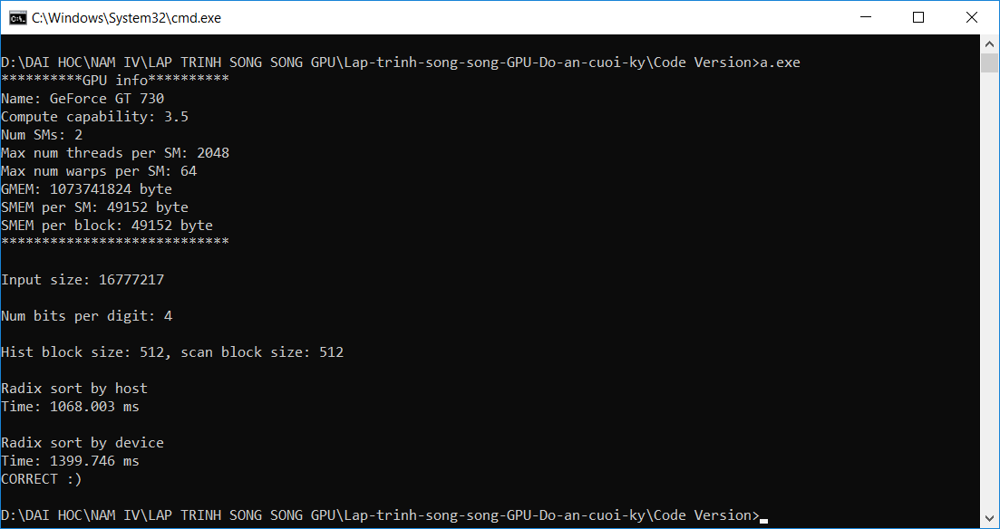
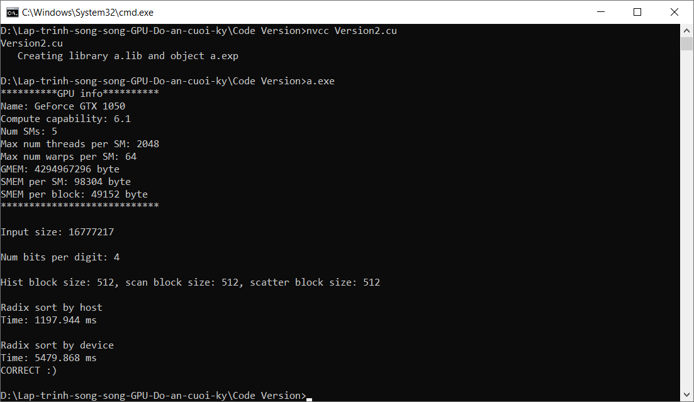
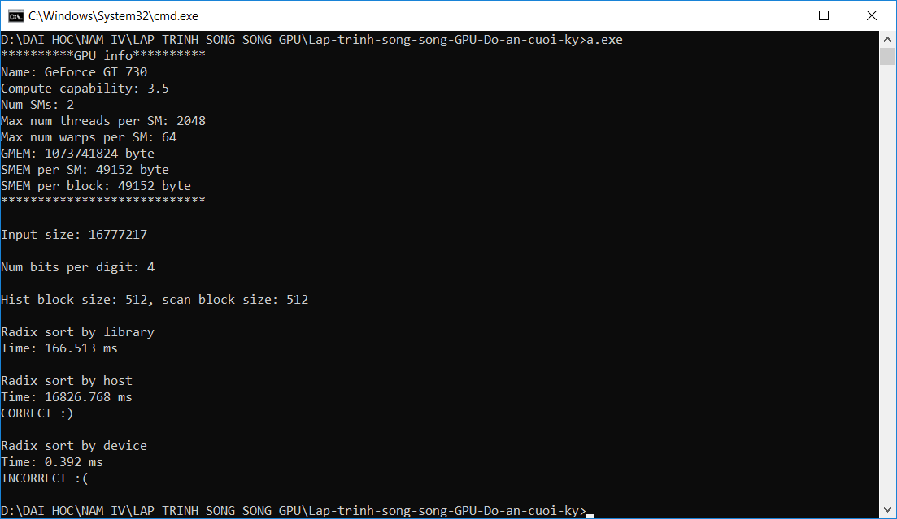
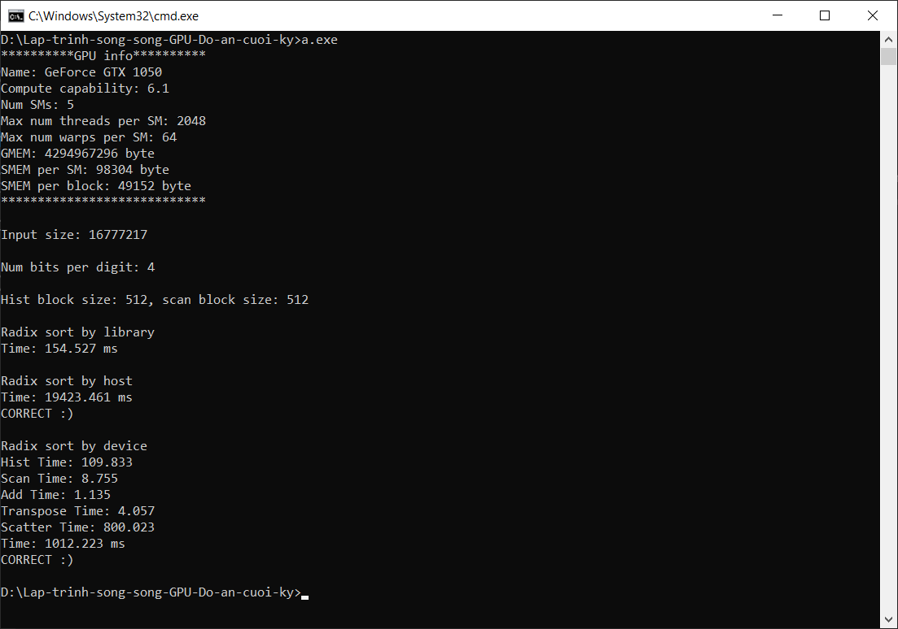

# Lập trình song song GPU: Đồ án cuối kỳ
Lập trình song song GPU: Đồ án thuật toán sắp xếp Radix Sort
## 1. Thông tin nhóm
|**STT**|**Họ và tên**|**MSSV**|
|:---:|:---:|:---:|
|1|Trần Nhật Huy|1612272|
|2|Nguyễn Thành Đạt|1612088|

## 2. Yêu cầu của đồ án
Đồ án sẽ gồm có 4 phiên bản baseline:
1. Cài đặt tuần tự thuật toán Radix Sort tuần tự (đã làm ở BT4)
2. Cài đặt song song 2 bước histogram và scan của thuật toán Radix Sort tuần tự (đã làm ở BT4)
3. Cài đặt song song thuật toán Radix Sort với k = 1 bit
4. Cài đặt tuần tự ý tưởng của thuật toán Radix Sort song song trong bài báo của NVIDIA (đây là phiên bản mà lúc sau ta sẽ tập trung song song hóa và tối ưu hóa).

**Đích đến:** Tối ưu gần bằng thuật toán sắp xếp có sẵn trong thư viện Thrust

## 3. Kế hoạch thực hiện (dự kiến)
**Ngày vấn đáp:** `10/01/2020`

|**Công việc**|**Ngày bắt đầu**|**Ngày kết thúc**|**Ngày hoàn thành thực tế**|
|---|:---:|:---:|:---:|
|Code thuật toán radix sort tuần tự|13/12/2019|16/12/2019|17/12/2019|
|Code thuật toán radix sort song song|17/12/2019|22/12/2019|22/12/2019|
|Viết baseline số 3|24/12/2019|24/12/2019|24/12/2019|
|Tối ưu thuật toán radix sort|25/12/2019|08/01/2020||
|Viết báo cáo|09/01/2020|09/01/2020||
|Viết slide|09/01/2020|09/01/2020||
|Dự phòng|10/01/2020|10/01/2020||

## 4. Họp nhóm và phân công công việc
* Lần 1:
    - Thời gian: 10/12/2019
    - Địa điểm: Qua Skype
    - Nội dung: Bàn về kế hoạch làm việc nhóm và tạo bảng kế hoạch thực hiện
* Lần 2:
    - Thời gian: 26/12/2019
    - Địa điểm: Ở trường
    - Nội dung: Bàn về kế hoạch tối ưu hóa, lúc này nhóm vừa hoàn thành thuật toán nhưng thời gian thực thi của hàm scatter còn lâu

|**Công việc**|**Người thực hiện**|  
|---|:---|  
|Viết thuật toán Radix Sort tuần tự|Trần Nhật Huy|
|Viết thuật toán Radix Sort song song|Nguyễn Thành Đạt|
|Viết thuật toán Radix Sort song song với k = 1|Trần Nhật Huy|
|Tối ưu thuật toán Radix Sort|Trần Nhật Huy và Nguyễn Thành Đạt|
|Làm slide|Nguyễn Thành Đạt|
|File làm việc nhóm|Trần Nhật Huy|

## 5. Kết quả các baseline + Hình ảnh chụp
#### Baseline 1 ([Version1.cu](Code%20Version/Version1.cu))

#### Baseline 2 ([Version1.cu](Code%20Version/Version1.cu))

#### Baseline 3 ([Version2.cu](Code%20Version/Version2.cu))

#### Baseline 4 ([Version3.cu](Code%20Version/Version3.cu))

## 6. Quy trình tối ưu thuật toán Radix Sort
Việc tối ưu thuật toán sẽ chia làm 3 bước: `Phân tích`, `Thiết kế` và `Cài đặt`  
Vì thầy sẽ đánh giá điểm dựa vào quy trình tối ưu thuật toán là có hợp lý hay không hơn là đánh giá vào thời gian chạy của thuật toán nên ***tất cả các bước tối ưu hóa sau khi cài đặt được thuật toán radix sort song song sẽ được ghi tiếp ở file này theo các bước trên***  
> Việc làm như vậy sẽ dễ dàng trong việc viết báo cáo về sau 
#### Bảng đo thời gian
|**Version**|**histogramKernel**|**scanBlkKernel**|**addBlkKernel**|**transposeKernel**|**scatterKernel**|**Total (ms)**| 
|:---:|:---:|:---:|:---:|:---:|:---:|:---:|  
|Baseline 1| | | | | |1166.061|  
|Baseline 2| | | | | |781.464|  
|Baseline 3| | | | | |5479.868|  
|Baseline 4 (Tuần tự)| | | | | |23341.660|   
|Parallel v1|110.776|9.042|1.437|4.189|809.525|1020.13|  
|Parallel v2|?|?|?|?|?|?|  
|Parallel v3|?|?|?|?|?|?|  
|Parallel v4|?|?|?|?|?|?|  
|Thrust| | | | | |?ms| 

#### 6.1. Lần tối ưu hóa 1
##### Phân tích
* Ta sẽ tiến hành song song hóa các bước ở baseline 4 để giảm tổng thời gian thực hiện
##### Thiết kế
* Thuật toán sẽ giống như được học trên lớp. Ở bước histogramKernel thì sau khi làm xong thì sẽ lưu xuống mảng 2 chiều với mỗi cột sẽ là một histogram cho dễ scan. Sau khi scan, ta sẽ chuyển vị lại cho dễ làm các bước sau. Ở bản này, bước scatter sẽ dùng một thread duy nhất trong block để chạy vì nhóm chưa tìm ra cách song song hóa.
##### Cài đặt 
* File code được cài đặt ở [Parallel_v1](Code%20Version/Parallel_v1.cu)  
* Kết quả:  
* Nhận xét: Tốc độ chạy nhanh hơn
#### 6.2. Lần tối ưu hóa 2
##### Phân tích
* Hiện tại, thuật toán chậm nhất ở phần Scatter. Lý do là vì nhóm đang sử atomicAdd để tính rank.
##### Thiết kế
* Nhóm sẽ viết lại thuật toán Scatter y như trong bài báo, sử dụng Radix Sort với k = 1 để tính rank của các phần tử trong Block
##### Cài đặt 
* File code được cài đặt ở [Parallel_v2](Code%20Version/Parallel_v2.cu)
* Kết quả: 
* Nhận xét: Tốc độ tăng lên đáng kể
#### 6.3 Lần tối ưu hóa 3
##### Phân tích
* Ở bước này, nhóm sẽ gán blockSize sao cho tận dụng được tối đa sức mạnh của GPU. Thực tế, bước này sẽ cần làm trước lần tối ưu hóa số 2 nhưng vì nhóm muốn hoàn thiện thuật toán giống như trong bài báo
##### Thiết kế
* Nhóm sẽ gán blockSize = Số-thread-tối-đa-trên-một-SM / Số-lượng-block-tối-đa-trên-một-SM
* Số block tối đa trên một SM có thể phụ thuộc vào Compute Capability của GPU, có thể tìm thấy [tại đây](https://docs.nvidia.com/cuda/cuda-c-programming-guide/index.html#compute-capabilities)
##### Cài đặt 
* File code được cài đặt ở [Parallel_v3](Code%20Version/Parallel_v3.cu)
* Kết quả: 
* Nhận xét: ....

#### 6.4 Lần tối ưu hóa 4
##### Phân tích
* Ở bước này, nhóm sẽ vẫn tối ưu hóa Scatter kernel. Ở phiên bản `Parallel_v3` thì trong Scatter Kernel nhóm sử dụng mảng 
smem để lưu dữ liệu và kích thước của mảng này không hề nhỏ khi nhóm lưu tới 6 loại mảng.
Song song với đó là nhóm sử dụng nhiều câu lệnh `__syncthreads()`
##### Thiết kế
* Thay vì smem trong Scatter kernel phải lưu 5 mảng khác nhau thì giờ đây nhóm sẽ thiết
kế lại: 
    - Phần 1 vẫn sẽ lưu input kích thước `blockDim.x` phần tử
    - Phần 2 lưu một phần tử giả, gọi là `dummy`, có `1` phần tử
    - Phần 3 lưu chuỗi nhị phân lấy được, kích thước `blockDim.x` phần tử
    - Phần 4 lưu chỉ số bắt đầu của mảng sau khi đã sắp xếp, kích thước `2 ^ nBits` phần tử
##### Cài đặt
* File code được cài đặt ở [Parallel_v4](Code%20Version/Parallel_v4.cu)
* Kết quả: 
* Nhận xét: ....

#### 6.5 Lần tối ưu hóa 5
##### Phân tích
* Ở lần này nhóm vẫn tiếp tục tối ưu hóa hàm Scatter kernel vì trong hàm này vẫn còn có nhiều 
câu lệnh `__syncthreads()` dùng để `debug` và chưa load mảng `scanHistogramArrayTranpose` vào `smem`
##### Thiết kế
* Ở lần trước thì `smem` gồm 4 phần dữ liệu, bây giờ ta sẽ thêm một phần chứa `scanHistogramArrayTranpose` cho từng block, sẽ có `2 ^ nBits` phần tử. Khi chép dữ liệu cần lưu ý rằng số thread có thể sẽ nhỏ hơn số `nBins`
##### Cài đặt
* File code được cài đặt ở [Parallel_v5](Code%20Version/Parallel_v5.cu)
* Kết quả: 
* Nhận xét: ....

#### 6.6 Lần tối ưu hóa 6
##### Phân tích
* Ở lần này, nhóm chưa suy nghĩ ra cách nào để tối ưu hàm Scatter kernel nữa. Do đó, nhóm sẽ thực hiện tối ưu ở điểm khác. Tổng thời gian chạy các hàm kernel chiếm phần lớn thời gian thực thi nhưng thời gian còn nằm ở những phần không thuộc các hàm kernel và nhóm sẽ tối ưu các hàm cấp phát bộ nhớ xem có giảm tổng thời gian thực thi hay không
##### Thiết kế
* Ở phần cấp phát bộ nhớ, hiện tại thì nhóm đang lãng phí tài nguyên khi có thể tái sử dụng `d_histArr` thay vì tạo `d_scanHistArrTranpose`
##### Cài đặt
* File code được cài đặt ở [Parallel_v6](Code%20Version/Parallel_v5.cu)
* Kết quả: 
* Nhận xét: ....
